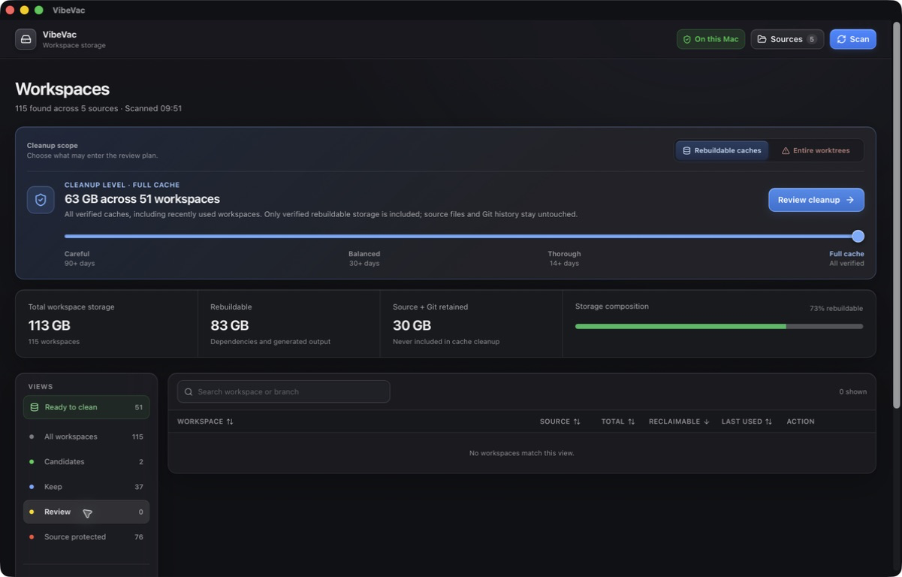

# VibeVac

**Keep the work. Vacuum the rebuildable weight.**

[](https://github.com/TargiX/vibevac/actions/workflows/ci.yml)
[](https://github.com/TargiX/vibevac/releases)
[](LICENSE)



AI coding tools make isolated workspaces cheap. Their copied dependencies,
framework output, test reports, and caches are not. VibeVac is a local control
center that separates valuable source and Git state from storage that can be
rebuilt.

It first shows that, for example, 1.3 GB of a 1.5 GB workspace is verified
rebuildable cache. If the remaining checkout is an old, fully proven linked
worktree, VibeVac can also offer its complete removal as a separate, explicitly
selected operation while keeping the branch and shared Git history.

## Download

**[Download VibeVac for macOS](https://github.com/TargiX/vibevac/releases/tag/v0.1.0)**

The `0.1.0` release is a signed and notarized universal app for Apple Silicon
and Intel Macs running macOS 12 or newer. Download the `.dmg`, drag VibeVac to
Applications, and open it normally. There is no account, telemetry, terminal,
Node.js installation, or background server.

VibeVac never removes anything during a scan. Cleanup always requires an
explicit scope, a complete revalidated preview, and typed confirmation.

## Native desktop app

VibeVac is desktop-first. A user downloads the macOS `.dmg`, drags VibeVac to
Applications, and opens it like any other utility. The installed app includes
the UI and the Rust scanning engine; it does not require Node.js, a terminal,
an account, or a server.

The Vue interface talks to Rust through Tauri IPC inside the application. No
HTTP port is opened. The CLI and its localhost dashboard remain available for
contributors and automation, but they are not the end-user installation path.

## Real dogfood result

On the machine where VibeVac was created:

```text
115 coding workspaces and repositories
113 GB total footprint
83 GB verified rebuildable caches
63 GB available at the Full cache level
30 GB source + Git retained
```

No real cache was deleted while producing those numbers.

## Control center

The primary product surface is the VibeVac desktop window. It provides:

- total, rebuildable, and retained sizes for every workspace;
- latest activity and running-process signals;
- Git branch, uncommitted work, upstream, and default-branch merge evidence;
- filters for `CANDIDATE`, `KEEP`, `REVIEW`, and `PROTECT`;
- a four-level cleanup slider that changes the inactivity window, selected
  storage, risk color, and visible table rows immediately;
- a separate `Entire worktrees` scope with 90, 60, 30, and 14-day levels and no
  automatic selection;
- expandable cache inventories;
- selection of individual cache directories;
- single-workspace and multi-workspace revalidated cleanup previews;
- manually selected linked-worktree removal with branch preservation and
  reconstruction instructions;
- explicit typed confirmation;
- an audit record after cleanup.

Nothing is removed automatically. The cleanup level filters what may enter a
plan; removal still requires explicit selection, a complete review, and typed
confirmation. Entire-worktree removal uses an independent scope so widening a
cache plan can never turn into checkout deletion.

## Workspace discovery

VibeVac does not crawl the whole disk. It starts with explicit, bounded sources
that exist on the current machine:

- `~/.codex/worktrees`
- `~/conductor/workspaces`
- common project folders: `~/Code`, `~/Developer`, `~/Projects`, `~/repos`,
  `~/src`, `~/workspace`, and `~/workspaces`
- `~/.openclaw/workspace`

The Sources panel shows every path and how many workspaces it contributed.
Users can add any other parent folder with the native macOS folder picker.
Added sources are stored locally and can be removed from the scan at any time.

Within a source, VibeVac searches a bounded number of directory levels for a
`.git` marker. A `.git` file identifies a linked worktree; a `.git` directory
identifies a standalone repository, which is reported but protected from
whole-workspace removal. Git state, not the folder name, determines the safety
classification.

For every standalone repository, VibeVac also reads Git's registered worktree
list. This finds local worktrees created by Cursor, Claude, Hermes, Codex, and
other tools even when they live outside the project folder. Nested worktrees
are accounted independently rather than counted again inside their parent.
Application databases, conversations, credentials, memory, and IDE
`workspaceStorage` are not cleanup targets.

## What qualifies as rebuildable

VibeVac uses an allowlist of known generated directories such as:

- `node_modules`
- `.nuxt`, `.next`, and `.svelte-kit`
- `.turbo` and `.parcel-cache`
- ignored `dist`, `build`, and `out`
- `coverage`, `playwright-report`, and `test-results`

A name match is not sufficient. Every directory must also be ignored by Git.
`node_modules` additionally requires a repository lockfile. Symlinks are not
accepted as cleanup targets.

## Cleanup transaction

Before removing selected caches, VibeVac:

1. repeats Git and cache inventory checks;
2. refuses arbitrary or newly changed paths;
3. checks for processes working inside the workspace;
4. resolves canonical paths and rejects symlinks or traversal;
5. shows the exact directories and bytes;
6. requires typing a workspace-specific confirmation, or one batch
   confirmation for the complete visible plan;
7. checks everything again at execution time;
8. records the result in `~/.vibevac/audit.jsonl`.

The cache flow never removes the workspace, source files, branch, or Git
history. The separate entire-worktree flow accepts only manually selected,
registered linked worktrees after proving they are clean, synced, merged, old,
process-free, and free of ignored data outside the narrow rebuildable allowlist. It uses `git worktree remove`,
preserves the branch and common Git repository, and records reconstruction
instructions. Standalone repositories are never eligible.

## Local security boundary

The desktop app runs scans and cleanup through application-local Tauri
commands. It has no account, telemetry, remote API, model, GitHub access, or
listening HTTP server. It invokes the system `git`, `du`, and `lsof` tools and
reads only the local workspace roots it reports in the UI.

The optional contributor command `vibevac ui` uses a localhost compatibility
server. That server binds only to `127.0.0.1` on an available port. Mutating
requests require a random in-memory session token and the matching browser
origin.

## CLI

The scanner and inspector remain useful without the dashboard:

```bash
vibevac scan
vibevac scan --stale-after 30
vibevac scan --root ~/worktrees
vibevac inspect ~/.codex/worktrees/4c66/my-app
vibevac scan --json > vibevac-report.json
```

### Recommendation model

| Recommendation | Meaning |
| --- | --- |
| `CANDIDATE` | Clean, remotely recoverable, merged, stale, and no process was detected. Still requires a human decision. |
| `KEEP` | Recently used or currently held by a running process. |
| `REVIEW` | Recoverable, but one intent signal cannot be proven. |
| `PROTECT` | Contains local-only work, is a standalone repository, or inspection was incomplete. |

Cache cleanup eligibility is independent from whole-workspace status. A dirty
workspace can still contain verified, ignored build caches while its source
changes remain protected.

See the complete [safety model](docs/safety-model.md).

## Build from source

To build the desktop app locally:

```bash
pnpm install
pnpm desktop:build
```

Building from source requires Node.js, pnpm, Rust, and the platform's Tauri
prerequisites. Those are build dependencies only; people installing a release
DMG do not need them.

See [the release guide](docs/releasing.md) for signing, notarization, and GitHub
Release steps.

## Optional CLI

The CLI is useful for scripts and headless inspection:

```bash
pnpm install
pnpm build
node dist/cli.js scan
```

After a future npm release:

```bash
npx vibevac ui
```

## Supported environments

- Desktop app: macOS 12+; the release artifact is universal for Apple Silicon
  and Intel Macs
- CLI: macOS and Linux with Node.js 20+
- Git
- `du` for disk sizing
- `lsof` for active-process protection

Automatic workspace roots:

- `~/.codex/worktrees`
- `~/conductor/workspaces`
- existing common project folders (`~/Code`, `~/Developer`, `~/Projects`,
  `~/repos`, `~/src`, `~/workspace`, `~/workspaces`)
- `~/.openclaw/workspace`, when present

Registered Git worktrees belonging to repositories in those roots are included
automatically. Other layouts can be added in the desktop Sources panel or
scanned from the CLI with `--root`.

## Development

```bash
pnpm install
pnpm check
pnpm desktop:dev
pnpm desktop:build
pnpm dev scan --no-size
pnpm dev:ui
```

The TypeScript and Rust test suites include real temporary Git repositories,
cache validation, active-process protection, token-protected local API
requests, and destructive cleanup only inside disposable fixtures.

## Roadmap

- **0.1:** native macOS app, scanner, evidence inspector, cache inventory,
  selective cache cleanup, and explicit linked-worktree removal
- **0.2:** package-manager-aware restore commands and cleanup history UI
- **0.3:** optional archive-before-removal workflows and richer reconstruction
  history
- **Later:** Windows/Linux desktop packages after the macOS safety loop is
  proven

VibeVac will not become another agent framework. Its job is to make the local
infrastructure around coding agents understandable and reclaimable.

## License

[MIT](LICENSE)
