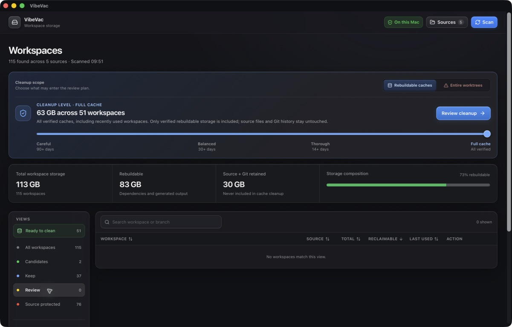

# VibeVac

**Keep the work. Vacuum the rebuildable weight.**

[](https://github.com/TargiX/vibevac/actions/workflows/ci.yml)
[](https://github.com/TargiX/vibevac/releases)
[](LICENSE)



AI coding tools are excellent at creating fresh workspaces. Tidying them up is
apparently beneath their pay grade.

VibeVac is an open-source, local macOS control center for the storage they leave
behind. It separates source code and Git state from dependencies, framework
output, test reports, and other data that can be rebuilt. Then it shows the
evidence and lets you decide what happens next.

When the evidence is incomplete, VibeVac does the least exciting — and most
useful — thing a cleaner can do: nothing.

## 📦 Get VibeVac

**[Download VibeVac 0.1.0 for macOS](https://github.com/TargiX/vibevac/releases/tag/v0.1.0)**

The current prerelease is a signed and notarized universal app for Apple Silicon
and Intel Macs running macOS 12 or newer. It does not want an account, your
email, a subscription, telemetry permission, or a small background daemon “for
your convenience.”

Scanning never removes anything. Cleanup requires an explicit scope, a complete
preview, fresh safety checks, and typed confirmation.

## 🧭 The idea

Most cleaners begin with a list of folders they know how to delete. VibeVac
starts with a stricter question:

> Can this machine prove that the data is rebuildable?

Source is not dirt. An old checkout is not automatically abandoned. A familiar
directory name is not proof. VibeVac combines filesystem boundaries, Git state,
activity, running-process checks, ignore rules, and reconstruction evidence
before it offers an action.

The hesitation is the feature.

## 🧪 The first patient

The first Mac scanned by VibeVac was the one used to build it:

```text
115 coding workspaces and repositories
113 GB total footprint
83 GB verified rebuildable caches
63 GB available at the Full cache level
30 GB source + Git retained
```

No real caches were deleted to produce those numbers. Even vacuum cleaners
should dogfood dry-run mode first.

## 🔎 What it shows

The control center gives every workspace an evidence trail instead of a mystery
badge:

- total, rebuildable, and retained size;
- latest activity and active-process signals;
- Git branch, uncommitted work, upstream, and default-branch merge evidence;
- `CANDIDATE`, `KEEP`, `REVIEW`, and `PROTECT` recommendations;
- a four-level cache cleanup slider that immediately changes the visible plan;
- a separate `Entire worktrees` scope that is never selected automatically;
- expandable cache inventories and per-directory selection;
- single-workspace and batch cleanup previews;
- typed confirmation and an audit record after cleanup;
- linked-worktree removal with branch preservation and reconstruction guidance.

Cleanup level only decides what may enter a plan. It never turns a wider cache
selection into worktree deletion.

## ♻️ What counts as rebuildable

VibeVac recognizes a deliberately narrow allowlist of generated directories,
including:

- `node_modules`;
- `.nuxt`, `.next`, and `.svelte-kit`;
- `.turbo` and `.parcel-cache`;
- ignored `dist`, `build`, and `out` directories;
- `coverage`, `playwright-report`, and `test-results`;
- Rust `target` next to a `Cargo.toml`, with Cargo's own marker inside;
- Python `.venv` and `venv` that contain `pyvenv.cfg`, next to a Python
  manifest such as `pyproject.toml`, `uv.lock`, or `requirements.txt`;
- SwiftPM `.build` next to `Package.swift`;
- CocoaPods `Pods` with `Manifest.lock`, next to `Podfile.lock`;
- Gradle `.gradle` next to a Gradle settings or build file;
- Dart and Flutter `.dart_tool` next to `pubspec.yaml`;
- Xcode `Intermediates.noindex`, `ModuleCache.noindex`, `Index.noindex`,
  `CompilationCache.noindex`, and `SDKStatCaches.noindex` inside verified
  DerivedData directories, including deeply nested `.context` builds.

A name match is not enough. Every directory must also be ignored by Git.
`node_modules` additionally requires a repository lockfile, ecosystem caches
with common names need the manifest and marker listed above, and symlinks are
never accepted as cleanup targets.

An Xcode cache also needs a regular `info.plist` identifying an Xcode workspace
or project at its DerivedData root. Release archives, dSYMs, IPAs, test result
bundles, and `Products` are retained. A broad build directory containing any of
these, a nested repository, or Xcode DerivedData is split into individual
verified caches instead of being offered for wholesale deletion. Directories
containing tracked files are not cleanup targets. If this bounded inspection
cannot prove safety, the enclosing directory is retained.

Batch reviews skip workspaces that fail a fresh safety check and show their
reasons alongside the accepted plans. An active workspace does not prevent
other verified workspaces from entering the review.

Complete worktree removal is a separate operation with a much higher bar. The
worktree must be registered, clean, synced, merged, old enough, process-free,
and free of ignored data outside the narrow rebuildable allowlist by default.
An explicit, session-only **Allow removal of protected worktrees** checkbox
bypasses merge, remote, local-file, and process protections. The time slider
still filters targets by 90, 60, 30, or 14 days; manual mode also offers **7+ days**; **All ages** explicitly includes
recent and unknown activity in manual mode. Each checkout
still needs explicit selection (individual rows or **Select all shown**), a fresh risk preview, and its exact `FORCE REMOVE`
confirmation. Local and ignored files are permanently deleted; running tasks
may break and are never stopped automatically. Shared Git history and branches
remain, including unpublished commits. Standalone repositories, detached
checkouts, and parents containing nested registered worktrees stay protected.

## 📍 Where it looks

VibeVac does not roam across the entire disk hoping to find something dramatic.
It scans explicit, bounded sources that exist on the Mac:

- `~/.codex/worktrees`;
- `~/conductor/workspaces`;
- common project folders such as `~/Code`, `~/Developer`, `~/Projects`,
  `~/repos`, `~/src`, `~/workspace`, and `~/workspaces`;
- `~/.openclaw/workspace`;
- any additional folder the user chooses in the Sources panel.

Within those roots, Git evidence determines what a directory is. A `.git` file
identifies a linked worktree; a `.git` directory identifies a standalone
repository. Registered worktrees are discovered even when Cursor, Claude,
Hermes, Codex, or another tool placed them outside the original project folder.

VibeVac does not inspect agent conversations, credentials, memories,
application databases, or IDE `workspaceStorage`.

## 🛡️ The trust model

Before removing selected caches, VibeVac:

1. repeats Git and cache inventory checks;
2. rejects arbitrary, changed, or newly introduced paths;
3. checks for processes working inside the workspace;
4. resolves canonical paths and rejects symlinks or traversal;
5. shows the exact directories and bytes;
6. requires a workspace-specific or batch-specific typed confirmation;
7. checks the complete plan again at execution time;
8. records the result in `~/.vibevac/audit.jsonl`.

The cache flow never removes the workspace, source files, branch, or Git
history. The worktree flow uses `git worktree remove`, preserves the branch and
common Git repository, and records reconstruction guidance.

See the complete [safety model](docs/safety-model.md).

## 🔒 Local means local

The desktop app runs scanning and cleanup through application-local Tauri
commands. There is no account, telemetry, remote API, model, GitHub access, or
listening HTTP server. It invokes the system `git`, `du`, and `lsof` tools and
reads only the workspace roots shown in the UI.

The optional contributor command `vibevac ui` uses a localhost compatibility
server bound to `127.0.0.1`. Mutating requests require a random in-memory session
token and matching browser origin.

## ⌨️ CLI

The scanner and inspector also work without the desktop UI:

```bash
vibevac scan
vibevac scan --stale-after 30
vibevac scan --root ~/worktrees
vibevac inspect ~/.codex/worktrees/4c66/my-app
vibevac scan --json > vibevac-report.json
```

Cleanup is available from the CLI too. Select an exact workspace and cache;
the default command only previews. Use the confirmation from that preview to
execute the same selection, with fresh safety checks and an audit entry:

```bash
vibevac clean /path/to/project --cache .context/native-build/ModuleCache.noindex
vibevac clean /path/to/project --cache .context/native-build/ModuleCache.noindex \
  --execute --confirm 'CLEAN parent/project'
vibevac clean /path/to/project --all --json
```

`--cache` is repeatable. `--all` explicitly selects every verified cache in
that one workspace; it never removes the workspace itself. Neither option
relaxes process, Git, or path checks. Reported cache sizes are estimates:
hardlinks, APFS clones, and concurrent disk activity affect actual free space.

### Recommendation model

| Recommendation | Meaning |
| --- | --- |
| `CANDIDATE` | Clean, remotely recoverable, merged, stale, and no process was detected. Still requires a human decision. |
| `KEEP` | Recently used or currently held by a running process. |
| `REVIEW` | Recoverable, but one intent signal cannot be proven. |
| `PROTECT` | Contains local-only work, is a standalone repository, or inspection was incomplete. |

Cache cleanup eligibility is independent from whole-workspace status. A dirty
workspace may still contain verified ignored build caches while its source
changes remain protected.

## 🛠️ Build and contribute

Contributions are welcome, especially reproducible edge cases, new fixtures,
and changes that make destructive code more boring. Safety changes need tests;
`probably fine` is not a storage format.

```bash
pnpm install
pnpm check
pnpm desktop:dev
pnpm desktop:build
```

Building the desktop app requires Node.js, pnpm, Rust, and the platform's Tauri
prerequisites. The TypeScript and Rust test suites use real temporary Git
repositories and perform destructive cleanup only inside disposable fixtures.

For CLI development:

```bash
pnpm dev scan --no-size
pnpm dev:ui
pnpm build
node dist/cli.js scan
```

See [the release guide](docs/releasing.md) for signing, notarization, and GitHub
Release steps.

## 💻 Supported environments

- Desktop app: macOS 12+, universal Apple Silicon and Intel release.
- CLI: macOS and Linux with Node.js 20+.
- System tools: Git, `du` for disk sizing, and `lsof` for active-process
  protection.

## 🗺️ Roadmap

- **0.1.x:** distribution, first-run trust, anonymized feedback, truthful scan
  progress, cancellation, incremental rescans, Pin, and Ignore.
- **0.2:** cleanup history and package-manager-aware restore guidance.
- **0.3:** canonical repository grouping, safe provenance, orphan review, and
  workspace lifecycle controls.
- **Later:** local growth budgets and cross-platform packages after the macOS
  safety loop is proven.

VibeVac will not become another agent framework. Its job is to make the local
infrastructure around coding agents understandable, reclaimable, and — when
necessary — reconstructable.

## 📄 License

[MIT](LICENSE)
